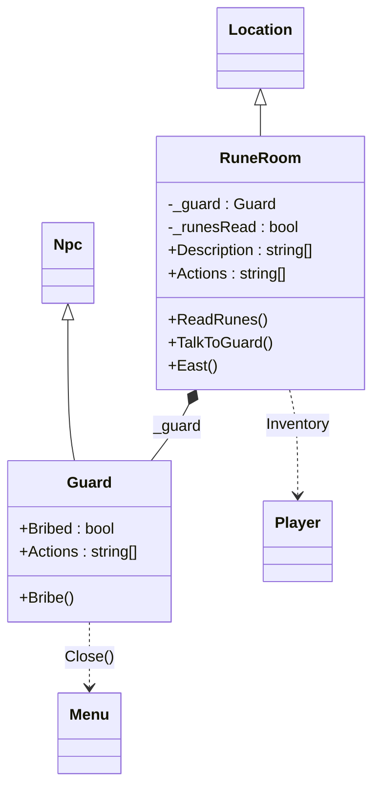

# Komposition, arv och ansvar i Jane the Ripper

Ni har byggt i tre dagar. Nu är det dags att titta på *hur* koden hänger ihop – inte för att ändra den, utan för att kunna förklara den. Det är det inlämningsuppgiften och projektet kommer att kräva: "motivera dina designval". Ha klassdiagrammet över hela motorn bredvid er när ni läser – det är uppdaterat med torsdagens tillägg.

## 1. Två sätt att återanvända: arv och komposition

Det finns två sätt att låta en klass använda en annan. **Arv** betyder "är en sorts": `Guard : Npc` – en vakt *är* en npc, och får med sig allt `Npc` (och `Interactive`) har. **Komposition** betyder "har en": `RuneRoom` har ett fält `_guard` av typen `Guard` – rummet *har* en vakt.

```csharp
class Guard : Npc                        // inheritance: Guard IS an Npc
{
    public bool Bribed;
    public override string[] Actions => ...;
    public void Bribe() { ... }
}

class RuneRoom : Location                // inheritance: RuneRoom IS a Location
{
    private readonly Guard _guard = new();   // composition: RuneRoom HAS a Guard

    public void TalkToGuard() => _guard.Run();   // and hands over to it
}
```

Båda finns i samma få rader, och de svarar på olika frågor. Arvet svarar på "vad *är* den här klassen, vad lovar den att kunna?" – en `Location` har `Name`, `Description`, `Actions` och `Run()`, det vet `World`. Kompositionen svarar på "vad *består* den av?" – runrummet består bland annat av en vakt.

**Tumregeln:** välj komposition först. Arv är rätt när basklassens *beteende* är exakt det ni vill ha och bara vill ändra en del av – `Interactive.Run()` ritar menyn likadant för alla, och ni byter bara ut `Actions`. Arv är fel när det bara är bekvämt: `class Guard : RuneRoom` hade gett vakten alla rummets fält gratis, men en vakt är inte ett rum, och koden hade blivit obegriplig. Ett tecken på fel arv är att subklassen inte använder det mesta den ärver.

Titta också på kedjan `Guard : Npc : Interactive`. `Npc` tillför nästan ingenting – bara `ExitLabel = "Stop talking"`. Ändå finns den, för att `Guard` ska kunna säga *vad den är*. Det är arv som dokumentation.

## 2. Separation av ansvar – vem vet vad?

Varje klass i motorn vet *en* sak. Det är inte en slump, det är designen:

| Klass | Ansvar | Vet **inte** |
|---|---|---|
| `Game` | Huvudmenyn. Bygger kartan i `Start()` och lämnar över till `World`. | Vad som finns i något rum. |
| `World` | Rutnätet, var spelaren står, loopen `Play()` som kör rum efter rum. | Vad man kan göra i ett rum. |
| `Interactive` | Namn, beskrivning, menyrader, och `Run()` som ritar allt. | Om den är ett rum, en person eller spelet självt. |
| `Location` | Utgångarna (från grannrutorna), inventariet, teleport. | Vilket rum det är – det vet subklassen. |
| Er `Location`-subklass | Vad som händer *här*: beskrivning, menyval, pusslet, vilken npc som finns. | Vad som händer i andra rum. |
| `Npc` + er subklass | Vad personen säger och minns. | Vilket rum hen står i. |
| `Player` | Vad spelaren bär. | Var spelaren står – det vet `World`. |
| `Menu` | Bygga en numrerad meny av strängar och anropa rätt metod. | Vad menyvalen betyder. |

Testet ni kan göra på er egen kod: **"är jag på väg att skriva något i klass X som handlar om Y?"** Skriver ni en `if` i `Game` som kollar om spelaren är i Mölle – stopp, det hör hemma i Mölle-rummets klass. Lägger vakten till ett föremål i `Player.Inventory` – bra, det är vaktens sak. Ändrar vakten var spelaren står – nej, det är rummets sak; vakten sätter `Bribed` och rummet läser det i sin `East()`. Det är exakt så `RuneRoom` gör.

Vinsten är den ni redan upplevt: sex grupper skriver i samma spel utan att röra varandras filer. Det är vad "separation av ansvar" betyder i praktiken.

## 3. Läsa befintlig kod – en metod

I projektet om tre veckor, och i varje jobb ni någonsin får, kommer ni att läsa mer kod än ni skriver. Det finns en teknik:

1. **Börja där programmet börjar.** `Program.cs`: `new Game().Run()`. Allt hänger under den raden.
2. **Hitta loopen.** `Game.Start()` skapar en `World` och kör `world.Play()`. I `Play()` finns `while (true)` som kör `At(_x, _y)!.Run()` om och om igen tills spelaren inte flyttat sig. Det är spelets hjärta.
3. **Följ ett menyval hela vägen.** Rummet har raden `"Talk to the guard:TalkToGuard"`. `Menu` slår upp metoden `TalkToGuard` *på rummet* och anropar den. Den anropar `_guard.Run()`, som ritar vaktens meny. Så sitter tre klasser ihop genom en sträng och ett metodnamn.
4. **Lägg märke till var typen är basklassen.** `At(_x, _y)` returnerar en `Location`, men objektet *är* en `RuneRoom`. När `Run()` läser `Description` och `Actions` körs `RuneRoom`:s versioner. Det är **polymorfism**: variabelns typ säger *vad den kan*, objektets klass bestämmer *vad som händer*.
5. **Skjut upp detaljerna.** `Menu.Create` använder reflektion – strunta i hur. `World.At`, `Enum.GetValues` – läs vad de heter och vad de returnerar. Gå in i dem först när ni behöver.
6. **Ställ frågor till koden.** "Var ändras `Player.Inventory`?" (bara i era rum och npc:er, plus `Clear()` i `Game.Start`). "Vem anropar `Menu.Close()`?" (`Location.Move` efter en förflyttning, och era metoder när ett samtal ska avslutas). Sök i hela projektet – att veta *var något ändras* är ofta hela förståelsen.

Den som kan berätta "`World` kör `Run()` på rummet, `Run()` bygger en meny av `Actions`, och varje val är en metod på rummet" har förstått motorn. Resten är detaljer.

## 4. Från diagram till kod – och tillbaka

Ett klassdiagram är kod utan kroppar: varje klass en låda med fält och metoder, och pilar för hur klasserna hänger ihop. Ni ska rita ett över **ert kluster** – på papper, innan er handledning.

Så här ser demoklustret ut som exempel (i Mermaid-syntax, men rita för hand):



Det som ska med: era klasser, vilka basklasser de ärver från (ihålig pil), vilka objekt de *äger* (fylld romb), vilka andra klasser de *anropar* (streckad pil), fälten som är ert minne (`_runesRead`, `Bribed`) och metoderna som menyraderna pekar på. Det som inte ska med: `Interactive`, `World`, `Menu` som fulla lådor – de räcker som mål för pilarna.

Under handledningen lägger vi diagrammet bredvid koden. Stämmer det? Ofta upptäcker man att ett fält saknas i diagrammet, eller att en pil i diagrammet inte finns i koden – och båda är värdefulla att hitta.

## 5. Repetition inför inlämningsuppgiften

Begreppen ni ska kunna förklara, med var de finns i spelet:

| Begrepp | En mening | I spelet |
|---|---|---|
| Klass / objekt | Ritning / sak byggd efter ritningen | `Guard` / `new Guard()` i `RuneRoom` |
| Konstruktor | Metod som körs vid `new`, sätter startvärden | Vi använder mest fältinitierare: `private readonly Guard _guard = new();` |
| Fält / property | Objektets minne / kontrollerad åtkomst till det | `private bool _runesRead` / `public override string[] Description => ...` |
| Inkapsling | Privat data, publika metoder som är enda vägen in | `_runesRead` ändras bara av `ReadRunes()` |
| Arv | "är en sorts", ärver fält och metoder | `Guard : Npc : Interactive` |
| `abstract` | Basklass som inte får skapas själv, bara ärvas | `Interactive`, `Location`, `Npc` |
| `virtual` / `override` / `base` | Basklassen tillåter byte, subklassen byter, `base.` anropar originalet | `Location.East()` / `RuneRoom.East()` / `base.East()` |
| Polymorfism | Variabelns typ är basklassen, objektets klass bestämmer vilken metod som körs | `World.Play()` kör `Run()` på en `Location` |
| Interface | Ett löfte om metoder, ingen kod | `IInteractive` |
| Komposition | "har en" | `RuneRoom` har `_guard` |
| `static` | Tillhör klassen, inte objektet | `Player`, `Menu.Close()` |
| Enum | Typ med fasta namngivna värden | `Direction` |
| `ToString()` | Hur objektet blir text | `Interactive.ToString()` ger `Name` |

Kan ni peka på varje rad i er egen kod och säga vilket begrepp det är, är ni redo för inlämningsuppgiften.
