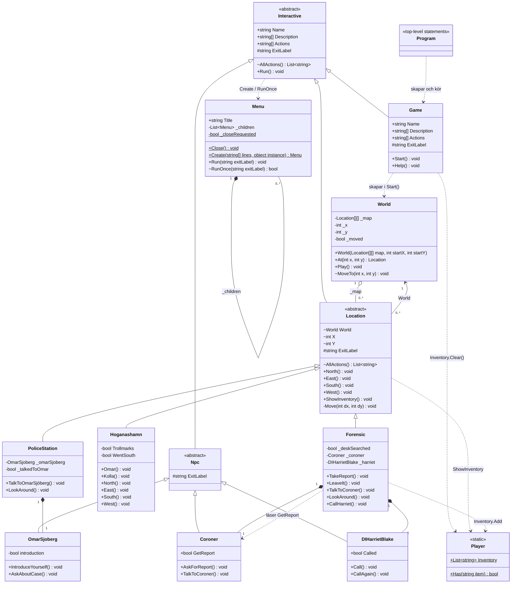

# UML – Jane the Ripper (halmstad-adventure)

## Förklaring av symboler

| Symbol | Betydelse |
|---|---|
| `+` / `-` / `#` / `~` | public / private / protected / internal |
| `$` | static |
| `<\|--` | arv (A är basklass till B) |
| `*--` | komposition – ägaren skapar och äger objektet (`new()` i fältet) |
| `o--` | aggregation – World håller Locations som skapas i `Game.Start()` |
| `-->` | association – Location har en referens tillbaka till sin World |
| `..>` | beroende – klassen använder den andra utan att spara den |
